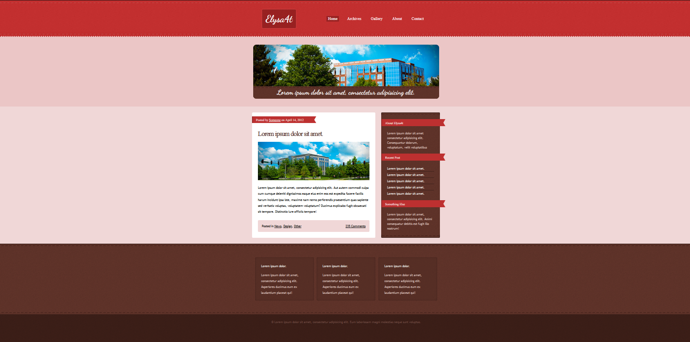

# WEB-LAB-7
<p align = "center">МИНИСТЕРСТВО НАУКИ И ВЫСШЕГО ОБРАЗОВАНИЯ<br>
РОССИЙСКОЙ ФЕДЕРАЦИИ<br>
ФЕДЕРАЛЬНОЕ ГОСУДАРСТВЕННОЕ БЮДЖЕТНОЕ<br>
ОБРАЗОВАТЕЛЬНОЕ УЧРЕЖДЕНИЕ ВЫСШЕГО ОБРАЗОВАНИЯ<br>
«САХАЛИНСКИЙ ГОСУДАРСТВЕННЫЙ УНИВЕРСИТЕТ»</p>
<br><br><br><br><br><br>
<p align = "center">Институт естественных наук и техносферной безопасности<br>Кафедра информатики<br>Шинкаренко Кирилл Константинович</p>
<br><br><br>
<p align = "center"><br><strong>Лабораторная работа №7.«CSS»</strong><br>01.03.02 Прикладная математика и информатика</p>
<br><br><br><br><br><br><br><br><br><br><br><br>
<p align = "right">Научный руководитель<br>
Соболев Евгений Игоревич</p>
<br><br><br>
<p align = "center">г. Южно-Сахалинск<br>2024 г.</p>
<br><br><br><br><br><br><br><br><br><br><br><br>

<h1 align = "center">Введение</h1>

<p><b>HTML</b> —  стандартизированный язык гипертекстовой разметки документов для просмотра веб-страниц в браузере. Веб-браузеры получают HTML документ от сервера по протоколам HTTP/HTTPS или открывают с локального диска, далее интерпретируют код в интерфейс, который будет отображаться на экране монитора.</p>
<p><b>CSS</b> — формальный язык описания внешнего вида документа, написанного с использованием языка разметки. Также может применяться к любым XML-документам, например, к SVG или XUL.</p>


<h1 style="text-align: center">Задачи CSS</h1>
<ol>
    <li>Повторить по образцу: сделать такой же макет используя материалы из архива lab7.zip</li>
</ol>


<h1 style="text-align: center">Решения HTML</h1>

<h2 style="text-align: center">Файл index.html</h2>

```html
<!DOCTYPE html>
<html lang="ru">
<head>
    <meta charset="UTF-8">
    <meta name="viewport" content="width=device-width, initial-scale=1.0">
    <link rel="stylesheet" href="/style.css">
    <link rel="preconnect" href="https://fonts.googleapis.com">
    <link href="https://fonts.googleapis.com/css2?family=Dancing+Script:wght@400..700&family=Pacifico&display=swap" rel="stylesheet">
    <link rel="preconnect" href="https://fonts.gstatic.com" crossorigin>
    <title>Lesson</title>
</head>
<body>

<header>
    <div class="logo">
        <p class="dancing-script-logo">Elysa4t</p>
    </div>

    <nav>
        <div class="links">
            <a class="selected-link" href="">Home</a>
            <a href="">Archives</a>
            <a href="">Gallery</a>
            <a href="">About</a>
            <a href="">Contact</a>
        </div>
    </nav>
</header>

<div class="container">
    <div class="banner">
        
        <p class="banner-image-label dancing-script-label">Lorem ipsum dolor sit amet, consectetur adipisicing elit.</p>
    </div>
</div>

<div class="container">
    <div class="content">
        <div class="content-block">
            <div class="content-mark">
                <p>Posted by <span style="text-decoration: underline">Someone</span> on April 14, 2012</p>
            </div>
            <div class="content-body">
                <h2 class="content-title">Lorem ipsum dolor sit amet.</h2>
                
                <p class="content-text">Lorem ipsum dolor sit amet, consectetur adipisicing elit. Aut autem commodi culpa cum cumque deleniti dignissimos eaque eius enim eos est expedita facere facilis harum incidunt ipsa iste, maxime nam nemo perferendis praesentium quas sapiente sed veritatis voluptas, voluptatem voluptatum? Ducimus explicabo fugit obcaecati sit tempore. Distinctio iure officiis tempore!</p>

                <div class="content-info">
                    <div class="content-categories">Posted in
                        <span class="content-category">News</span>,
                        <span class="content-category">Design</span>,
                        <span class="content-category">Other</span>
                    </div>
                    <div class="content-comment">235 Comments</div>
                </div>

            </div>
        </div>

        <div class="content-menu">
            <div class="content-menu-top"></div>
            <div class="content-menu-block">
                <div class="content-mark">About Elysa4t</div>
                <div class="content-menu-wrapper">
                    <p class="content-menu-text">Lorem ipsum dolor sit amet consectetur adipisicing elit. Consequuntur dolorum,
                        voluptatum, velit voluptatibus</p>
                </div>
            </div>
            <div class="content-menu-block">
                <div class="content-mark">Recent Post</div>
                <div class="content-menu-wrapper">
                    <p class="content-menu-last-post">Lorem ipsum dolor sit amet.</p>
                    <p class="content-menu-last-post">Lorem ipsum dolor sit amet.</p>
                    <p class="content-menu-last-post">Lorem ipsum dolor sit amet.</p>
                    <p class="content-menu-last-post">Lorem ipsum dolor sit amet.</p>
                    <p class="content-menu-last-post">Lorem ipsum dolor sit amet.</p>
                </div>
            </div>
            <div class="content-menu-block">
                <div class="content-mark">Something Else</div>
                <div class="content-menu-wrapper">
                    <p class="content-menu-text">
                        Lorem ipsum dolor sit amet, consectetur adipisicing elit. Animi consequatur debitis est fugit illo nostrum!
                    </p>
                </div>
            </div>
            <div class="content-menu-bottom"></div>
        </div>
    </div>
</div>

<div class="container">
    <div class="widgets-info-wrapper">
        <div class="widgets-info">
            <div class="widget-info">
                <div class="widget-info-top"></div>
                <div class="widget-info-content">
                    <div class="widget-info-title">Lorem ipsum dolor.</div>
                    <div class="widget-info-body">Lorem ipsum dolor sit amet, consectetur adipisicing elit. Asperiores ducimus eum ex laudantium placeat qui!</div>
                </div>
                <div class="widget-info-bottom"></div>
            </div>
            <div class="widget-info">
                <div class="widget-info-top"></div>
                <div class="widget-info-content">
                    <div class="widget-info-title">Lorem ipsum dolor.</div>
                    <div class="widget-info-body">Lorem ipsum dolor sit amet, consectetur adipisicing elit. Asperiores ducimus eum ex laudantium placeat qui!</div>
                </div>
                <div class="widget-info-bottom"></div>
            </div>
            <div class="widget-info">
                <div class="widget-info-top"></div>
                <div class="widget-info-content">
                    <div class="widget-info-title">Lorem ipsum dolor.</div>
                    <div class="widget-info-body">Lorem ipsum dolor sit amet, consectetur adipisicing elit. Asperiores ducimus eum ex laudantium placeat qui!</div>
                </div>
                <div class="widget-info-bottom"></div>
            </div>
        </div>
    </div>
</div>
<div class="container">
    <div class="copyright">© Lorem ipsum dolor sit amet, consectetur adipisicing elit. Eum laboriosam magni molestias neque sunt voluptas.</div>
</div>
</body>
</html>
```
<h2 style="text-align: center">style.css</h2>

```css
* {
    margin: 0;
    padding: 0;
    box-sizing: border-box;
}

body {
    font-family: "Trebuchet MS", Arial, Helvetica, sans-serif;
}

.container {
    width: 100%;
    display: flex;
    justify-content: center;
}

header {
    background-image: url("/assets/header-wrapper-bg.png");
    padding: 41px 0;
    display: flex;
    align-items: center;
    justify-content: center;
}

nav {
    display: flex;
    justify-content: center;
}

.widgets {
    background-image: url("/assets/footer-content-bg-02.png");
}

.inc {
    background-image: url("/assets/footer-bg.png");
}

.logo {
    background-image: url("/assets/logo-bg.png");
    background-size: 100% 100%;
    border-radius: 10px;
    padding: 22px;
    margin-right: 150px;
}

.links a {
    color: white;
    text-decoration: none;
    margin-right: 25px;
    padding: 5px 10px;
    background-size: 100% 100%;
    font-size: 20px;
    font-family: 'Times New Roman', Times, serif;
}

.selected-link {
    background-image: url("/assets/logo-bg.png");
}

.container:has(>.banner) {
    background-color: rgb(235,198,198);
}

.banner {
    width: 950px;
    display: flex;
    position: relative;
    justify-content: center;
    margin: 40px 0;
}

.banner-image {
    width: 100%;
    position: relative;
    border-image: url("assets/banner-border-bg.png");
    border-radius: 16px;
}

.banner-image-label {
    bottom: 0;
    background-image: url("assets/banner-caption-bg.png");
    position: absolute;
    width: 100%;
    height: 63px;
    border-bottom-right-radius: 16px;
    border-bottom-left-radius: 16px;
    text-align: center;
    line-height: 60px;
}

.dancing-script-logo {
    font-family: "Dancing Script", cursive;
    font-optical-sizing: auto;
    font-weight: 700;
    font-style: normal;
    font-size: 50px;
    color: white;
}

.dancing-script-label {
    font-family: "Dancing Script", cursive;
    font-optical-sizing: auto;
    font-weight: bold;
    font-style: normal;
    font-size: 35px;
    color: white;
} 

.container:has(>.widgets-info-wrapper) {
    background: url(assets/footer-content-bg-01.png) repeat;
}

.widgets-info-wrapper {
    width: 100%;
    overflow: hidden;
    padding: 40px 0 30px 0;
    background: url(assets/footer-content-bg-02.png) repeat-x;
    display: flex;
    flex-direction: row;
    justify-content: center;
}

.widgets-info {
    display: flex;
    flex-direction: row;
    gap: 15px;
    padding: 30px 0;
    justify-content: space-between;
    width: var(--width);
}
.widget-info {
    width: 300px;
}

.widget-info-title {
    padding-bottom: 20px;
}
.widget-info-body {
    color: #E1C9C4;
    line-height: 190%;
}

.container:has(>.copyright) {
    overflow: hidden;
    height: 155px;
    background: url(assets/footer-bg.png);
}

.copyright {
    margin: 0px;
    padding: 40px 0px 0px 0px;
    text-shadow: 1px 1px 2px rgba(39, 20, 17, 1);
    text-align: center;
    color: #784F45;
}

.widget-info-top {
    height: 15px;
    background: url(assets/box-widget-bg-01.png);
}
.widget-info-bottom {
    height: 15px;
    background: url(assets/box-widget-bg-03.png);
}
.widget-info-content {
    padding: 20px 30px 10px 30px;
    background: url(assets/box-widget-bg-02.png);
    color: white;
}

.container:has(>.content) {
    background-color: rgb(240, 215, 215);
}
.content {
    display: grid;
    grid-template-columns: 2.1fr 1fr;
    margin: 30px 0 30px 0;
    grid-gap: 30px;
    width: 960px;
}

.content-body {
    padding: 90px 30px 30px 30px;
    margin-bottom: 70px;
}

.content-block {
    display: inline-block;
    position: relative;
    background-color: white;
    border-radius: 5px;
}

.content-img {
    width: 100%;
    margin: 20px 0;
    border-radius: var(--borderRaund);
}

.content-info {
    display: flex;
    position: absolute;
    bottom: 30px;
    width: calc(100% - 60px);
    background-color: rgb(240, 215, 215);
    border-radius: 5px;
    padding: 20px;
    margin-top: 30px;
    justify-content: space-between;
}

.content-info .content-comment {
    text-decoration: underline;
}

.content-category {
    text-decoration: underline;
}

.content-mark {
    position: absolute;
    width: 330px;
    padding-top: 10px;
    padding-bottom: 25px;
    padding-left: 20px;
    background-image: url("assets/sidebar-title-bg.png");
    background-size: 100% 100%;
    max-height: 30px;
    top: 20px;
    left: 0;

    font-family: 'Arvo', serif;
    color: white;
    font-size: 16px;
    font-weight: 400;
}

.content-menu {
    background-image: url('assets/p.png');
    border-radius: 5px;
    height: fit-content;
}

.content-text {
    line-height: 190%;
}
.font_dancing-script {
    text-align: center;
    text-decoration: none;
    font-weight: normal;
    font-family: 'Cookie', cursive;
    color: #FFFFFF;
}

.font_dancing-script_logo {
    font-weight: 700;
    font-size: 50px;
}

.font_dancing-script_label {
    font-size: 35px;
}

.content-menu-block {
    position: relative;
    padding-top: 80px;
}
.content-menu-block:last-child {
    padding-bottom: 30px;
}

.content-menu-last-post {
    color: white;
    padding: 5px 0;
    border-bottom: #0000005c solid;
}
.content-menu-last-post:last-child {
    border-bottom: none;
}
.content-menu-wrapper {
    padding: 0 30px;
}
.content-menu-text {
    color: #E1C9C4;
    line-height: 160%;
    font-size: 15px;
}
.content-menu-top {
    height: 15px;
    background: url(assets/sidebar-bg-01.png);
}

.content-menu-bottom {
    margin-top: 20px;
    height: 15px;
    background: url(assets/sidebar-bg-03.png);
}

.content-title {
    display: block;
    font-weight: 400;
    letter-spacing: -2px;
    font-family: 'Arvo', serif;
    font-size: 34px;
    color: #4E2B22;
}
```

<h1 align = "center">Результат HTML</h1>
    <div style="display: flex; flex-direction: column">
        
    </div>

<h1 align = "center">Вывод</h1>
<p>По итогу проделанной работы была создана страница по образцу.</p>
